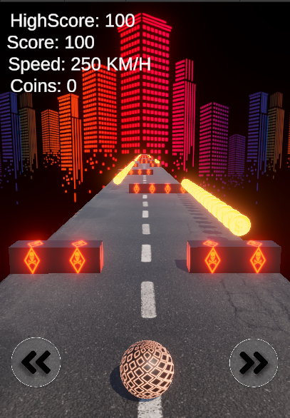

# 🏀 Ball Rolling Game

<div align="center">


**🎯 A thrilling 3D endless runner where physics meets fun!**

*Roll fast, collect coins, avoid obstacles - How far can you go?*



[](./Releases/BallRolling-v1.0.apk)
[](./Assets/)

</div>

---

## ✨ Features

<table>
<tr>
<td width="50%">

### 🎮 **Gameplay**
- 🏃‍♂️ **Endless Runner** - Infinite procedurally generated roads
- ⚡ **Physics-Based** - Realistic ball movement with Unity Rigidbody
- 🪙 **Coin Collection** - Gather coins to unlock customizations
- 🎯 **High Scores** - Beat your personal best distance
- 💥 **Dynamic Obstacles** - Test your reflexes and timing

</td>
<td width="50%">

### 🎨 **Visual & Audio**
- ✨ **Glowing Effects** - Customizable emission materials
- 🎵 **Immersive Audio** - Sound effects for every action
- 📱 **Mobile Optimized** - Smooth 60fps on mobile devices
- 🎥 **Cinematic Camera** - Dynamic following system
- 🌈 **Color Customization** - Multiple ball themes to unlock

</td>
</tr>
</table>

---

## 🕹️ Controls

<div align="center">

| Platform | Control | How to Play |
|:--------:|:-------:|:-----------:|
| 📱 **Android Device** | Touch Controls | Download APK → Install → Play |
| 🎮 **PC (Unity Editor)** | Arrow Keys | Open Project → Press Play |

</div>

---

## 🎯 How to Play

> **Objective:** Roll as far as possible while collecting coins and avoiding obstacles!

```
🎮 GAMEPLAY FLOW
│
├── 🏁 Start Rolling
├── ⬅️➡️ Navigate Left/Right  
├── 🪙 Collect Coins (+Points)
├── 🚧 Avoid Obstacles
├── 📏 Distance = Score
└── 🏆 Beat High Score!
```

### 💀 Game Over Conditions
- 💥 **Collision** with obstacles
- 🏃‍♂️ **Fall Off** the road (too far left/right)

---

## 🛍️ Shop System

<div align="center">

**💰 Spend your collected coins wisely!**

| Feature | Description |
|:-------:|:-----------:|
| 🎨 **Color Themes** | Unlock vibrant glowing ball colors |
| ✨ **Emission Effects** | Customize your ball's glow intensity |
| 🔐 **Persistent Unlocks** | Keep your purchases forever |
| 🎯 **Active Selection** | Choose your favorite style |

</div>

---

## 🛠️ Technical Highlights

<div align="center">

### 🔧 **Built with Modern Unity Practices**

</div>

| Component | Technology | Purpose |
|:---------:|:----------:|:-------:|
| ⚙️ **Movement System** | Unity Physics | Realistic ball dynamics |
| 🎵 **Audio Manager** | Singleton Pattern | Consistent sound experience |
| 📷 **Camera System** | LateUpdate Tracking | Smooth following |
| 🏗️ **Road Generation** | Procedural System | Infinite world creation |
| 💾 **Save System** | PlayerPrefs | Persistent progress |
| 📱 **Touch Controls** | Event System | Mobile-friendly input |

---

## 🎮 Game Stats Dashboard

<div align="center">

**📊 Real-time performance metrics**

🏃‍♂️ **Speed Display** | 📏 **Distance Tracking** | 🪙 **Coin Counter** | 🏆 **High Score**
:---: | :---: | :---: | :---:
Live KM/H readout | Real-time score updates | Session & total coins | Personal best record

</div>

---

## 🚀 Platform Support

<div align="center">

### 📱 **Primary Platform: Android**
[](./Releases/BallRolling-v1.0.apk)
[](#)
[](#)

### 🎮 **Development Platform: Unity Editor**
[](#)
[](#)
[](#)

</div>

---

## 🏁 Getting Started

<div align="center">

### 📱 **For Android Users**

</div>

```bash
# 1️⃣ Download APK
Click "Download APK" button above or go to Releases/BallRolling-v1.0.apk

# 2️⃣ Install on Android
Enable "Unknown Sources" in Settings → Install APK

# 3️⃣ Play!
Launch the game and start rolling!
```

<div align="center">

### 🎮 **For Unity Developers**

</div>

```bash
# 1️⃣ Clone the Repository
git clone https://github.com/C0de-N1nja/Ball-Rolling-3D.git

# 2️⃣ Open in Unity
Unity Hub → Add → Select Project Folder

# 3️⃣ Required Unity Version
Unity 2022.3 LTS or newer

# 4️⃣ Play in Editor
File → Open Scene → Game Scene → Press Play
```

### 📋 **Requirements**
- 🎮 Unity 2022.3 LTS+
- 📝 TextMeshPro Package
- 🖼️ Unity UI Package
- 🎵 Audio clips (button, coin, obstacle sounds)

---

<div align="center">

**🎮 Ready to roll? Download now and challenge yourself to reach new distances!**

</div>